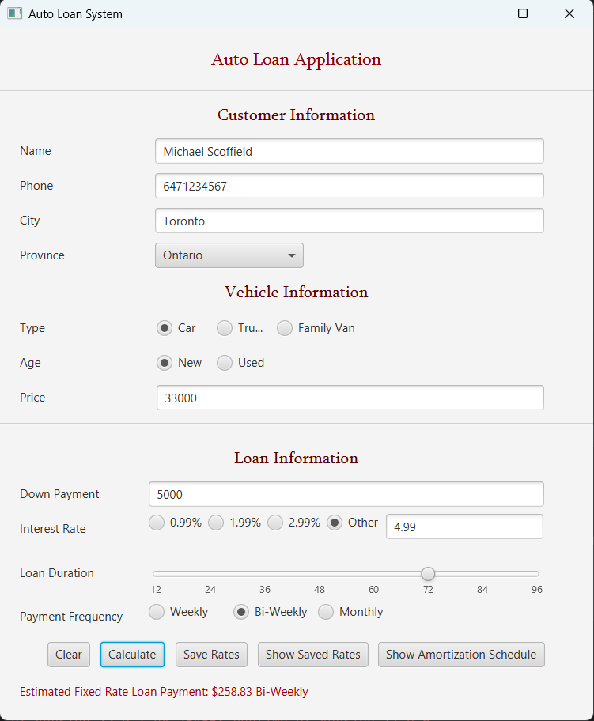
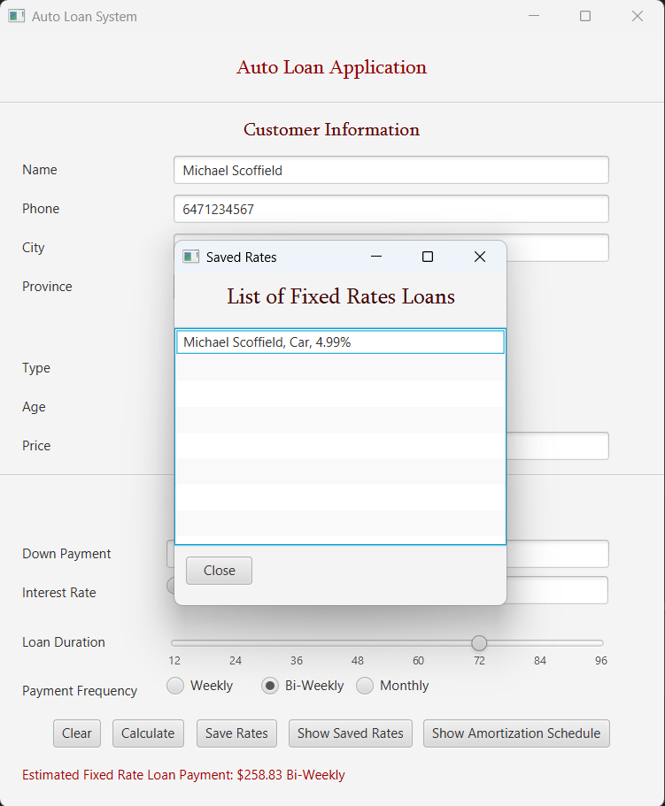
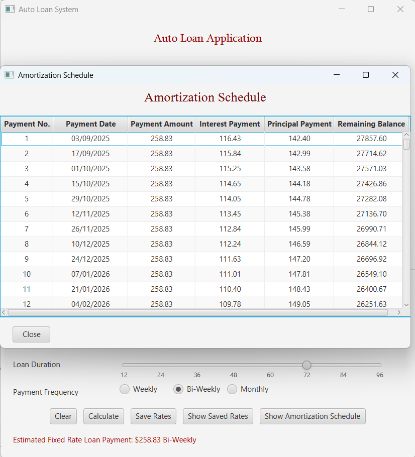

# Auto Loan Application System

A comprehensive JavaFX-based desktop application for calculating auto loan payments with detailed amortization schedules and loan management features.

## 📋 Overview

This Auto Loan Application System provides a complete solution for calculating vehicle loan payments, managing customer information, and generating detailed amortization schedules. Built with JavaFX and featuring an intuitive user interface with comprehensive validation and data persistence.

## ✨ Features

### 🔐 User Authentication

- Secure login system with predefined credentials
- Session management and navigation control

### 👤 Customer Management

- **Customer Information**: Name, phone, city, and province tracking
- **Input Validation**: Phone number format validation (10 digits)
- **Province Selection**: Dropdown with all Canadian provinces and territories

### 🚗 Vehicle Information

- **Vehicle Types**: Car, Truck, Family Van options
- **Vehicle Age**: New or Used vehicle selection
- **Price Validation**: Ensures positive vehicle pricing

### 💰 Loan Calculation

- **Down Payment**: Customizable down payment amounts
- **Interest Rates**: Pre-defined rates (0.99%, 1.99%, 2.99%) or custom rate input
- **Loan Duration**: Flexible terms from 12 to 96 months via slider control
- **Payment Frequency**: Weekly, Bi-Weekly, or Monthly payment options
- **Real-time Calculation**: Instant payment estimation with comprehensive validation

### 📊 Amortization Schedule

- **Detailed Schedule**: Payment-by-payment breakdown
- **Payment Information**: Payment number, date, amount, interest, and principal
- **Remaining Balance**: Track outstanding loan balance over time
- **Formatted Display**: Professional table presentation with proper formatting

### 💾 Data Management

- **Save Loan Rates**: Store calculated loan scenarios
- **Load Saved Rates**: Retrieve and modify previously saved loans
- **In-Memory Storage**: Session-based loan management

### 🎨 User Interface

- Modern JavaFX interface with FXML-based scenes
- Responsive design with intuitive form layouts
- Real-time validation feedback
- Professional styling with consistent color scheme

## 🛠️ Technical Stack

- **Language**: Java
- **UI Framework**: JavaFX with FXML
- **Architecture**: MVC (Model-View-Controller) with Interface implementation
- **Build Tool**: Maven
- **Design Patterns**: Interface segregation, Observer pattern for UI updates

## 📁 Project Structure

```
src/main/java/
├── Controllers/                 # JavaFX Controllers
│   ├── AutoLoanController.java      # Main loan application logic
│   ├── AmortizationController.java  # Amortization schedule display
│   ├── LoginController.java         # User authentication
│   └── SavedRateController.java     # Saved loans management
├── Models/                     # Data Models
│   ├── Customer.java              # Customer information model
│   ├── FixedRateLoan.java          # Fixed rate loan implementation
│   ├── Loan.java                   # Base loan class
│   ├── LoanAmortization.java       # Amortization schedule entry
│   ├── Login.java                  # Authentication model
│   └── Vehicle.java                # Vehicle information model
├── Interfaces/                 # Interface Definitions
│   └── LoanCalculation.java        # Loan calculation interface
└── ca/workshop3/
    └── AutoLoanApplication.java    # Main application class

src/main/resources/ca/workshop3/
├── *.fxml                      # JavaFX Scene Files
└── module-info.java            # Module configuration
```

## 📸 Screenshots

**Auto loan application dashboard**  


**List of Fixed Rates Loans**  


**Amortization Schedule**  


## 🚀 Getting Started

### Prerequisites

- Java 11 or higher
- JavaFX runtime
- Maven (for dependency management)

### Installation

1. Clone the repository
2. Navigate to the project directory
3. Build the project using Maven:
   ```bash
   mvn clean compile
   ```
4. Run the application:
   ```bash
   mvn javafx:run
   ```

### Login Credentials

- **Username**: `user1`
- **Password**: `pass1`

Alternative:

- **Username**: `user2`
- **Password**: `pass2`

## 💡 Usage

### Calculating a Loan

1. **Login** with provided credentials
2. **Enter Customer Information**:
   - Full name
   - 10-digit phone number
   - City and province
3. **Select Vehicle Details**:
   - Choose vehicle type (Car/Truck/Family Van)
   - Select age (New/Used)
   - Enter vehicle price
4. **Configure Loan Terms**:
   - Enter down payment amount
   - Select interest rate or enter custom rate
   - Adjust loan duration using slider (12-96 months)
   - Choose payment frequency
5. **Calculate** to see estimated payment
6. **View Amortization Schedule** for detailed payment breakdown

### Managing Saved Loans

- **Save Current Loan**: Store loan configuration for future reference
- **View Saved Rates**: Browse previously saved loan scenarios
- **Load Saved Loan**: Double-click to load saved loan into main form

## 🔧 Key Components

### Models

- **Loan**: Abstract base class with common loan properties
- **FixedRateLoan**: Implements loan calculation logic and amortization generation
- **Customer**: Customer information container
- **Vehicle**: Vehicle details and pricing
- **LoanAmortization**: Individual payment schedule entry

### Controllers

- **AutoLoanController**: Main application logic and form management
- **LoginController**: Authentication and session management
- **AmortizationController**: Amortization schedule display and formatting
- **SavedRateController**: Saved loans management and selection

### Interface Implementation

- **LoanCalculation**: Defines contract for payment calculation and amortization generation

## 🎯 Validation Rules

### Customer Information

- **Name**: Required field, cannot be empty
- **Phone**: Must be exactly 10 digits
- **City**: Required field, cannot be empty
- **Province**: Must be selected from dropdown

### Vehicle Information

- **Price**: Must be positive number, greater than zero
- **Type and Age**: Radio button selections required

### Loan Information

- **Down Payment**: Must be positive, cannot exceed vehicle price
- **Interest Rate**: Must be valid number when using custom rate
- **Duration and Frequency**: Handled by UI controls

## 🧮 Loan Calculation Formula

The application uses the standard fixed-rate loan payment formula:

```
Payment = (Principal × Monthly Interest Rate) / (1 - (1 + Monthly Interest Rate)^(-Total Periods))
```

Where:

- **Principal** = Vehicle Price - Down Payment
- **Monthly Interest Rate** = Annual Rate / 100 / 12
- **Total Periods** = Adjusted based on payment frequency

## 📈 Amortization Features

### Schedule Generation

- **Payment Number**: Sequential payment tracking
- **Payment Date**: Calculated based on frequency and start date
- **Payment Amount**: Fixed payment amount throughout loan term
- **Interest Payment**: Interest portion of each payment
- **Principal Payment**: Principal portion of each payment
- **Remaining Balance**: Outstanding balance after each payment

### Display Features

- **Formatted Currency**: Two decimal place formatting for all monetary values
- **Date Formatting**: DD/MM/YYYY format for payment dates
- **Center Alignment**: Professional table presentation
- **Scrollable View**: Handle long amortization schedules

## 🔄 Future Enhancements

- Database integration for persistent storage
- Advanced reporting and loan comparison features
- Email integration for loan details
- Print functionality for amortization schedules
- Multi-currency support
- Loan pre-approval features
- Integration with external interest rate APIs

## 📄 License

This project is developed as part of academic coursework and is for educational purposes.

---

**Note**: This application demonstrates advanced Java programming concepts including interface implementation, JavaFX UI development, financial calculations, date manipulation, and comprehensive form validation. The modular architecture allows for easy extension and maintenance.
